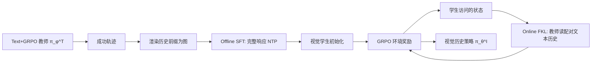

> 2026-08-13 · 文献阅读 #14 · 方向：多模态 · RL · 推理 · OPD · Agentic · 视觉-文本压缩

## TL;DR

一句话：**把多步 Agent 的交互历史渲染成图像，省 token 的同时会换掉策略本身——缺口主要不是 OCR 读不出来，而是视觉历史策略在搜什么、何时停、如何用证据上系统性跑偏。CAPS 用同一模型更强的文本历史策略，分两阶段（离线轨迹自蒸馏 + 在线策略自蒸馏）把决策行为迁到视觉接口上，SearchQA 相对 AgentOCR 提升 5.0/3.4 分，ALFWorld 全历史提升 15.6/14.5 分，峰值上下文最多省 83.4%。**

- **核心发现**：① GRPO 把 7B 视觉历史 Agent 的 SearchQA 从 14.0% 拉到 40.1%，History QA 反而从 82.78% 掉到 78.22%——任务涨分不是因为更会读图；② 匹配语义状态下，仅改历史模态就会改动作类型、查询内容和停止时机，第一步检索后视觉策略有 55.4% 直接作答，文本策略只有 29.8%；③ 轨迹质量五维（证据吸收、实体关系、查询递进、停止校准、答案 grounding）文本全面领先。
- **方法 CAPS**：冻结文本历史教师 $\pi_\phi^T$，训练视觉历史学生 $\pi_\theta^I$。Stage 1 把成功文本轨迹的历史前缀渲染成图，对学生做完整响应（推理+动作）的 next-token SFT；Stage 2 在 GRPO 中对学生自己访问的状态，用配对文本历史做全词表 forward KL，环境奖励仍是主信号。
- **炸裂结果**：7B CAPS 在 SearchQA 上 43.5，超过自己的文本教师 43.0；ALFWorld 全历史 95.7%，比文本教师还高 3.1 分。History QA 继续下降到 73.70——进一步证明增益来自“更会用读到的信息做决策”，不是更会 OCR。

---

## 文献信息

| 字段 | 内容 |
|-|-|
| 标题 | Reading is not Reasoning: Bridging the Agentic Policy Gap in Vision–Text Compression |
| 作者 | Cheng Fan, Junyi Zhou, Tingzhang Luo, RongJian Xu, Qiyanhui Lu, Mingjian Zhu, Hanting Chen, Jianyuan Guo（通讯） |
| 发布时间 | 2026-08（arXiv v1） |
| 链接 | [arXiv:2608.08960](https://arxiv.org/abs/2608.08960) |
| 代码 | 论文写“后续公开”，当前尚未放出 |
| 基底 | Qwen2.5-VL-3B / 7B-Instruct；教师为同族 Text+GRPO |
| 评测 | SearchQA（NQ/TriviaQA/PopQA/HotpotQA/2Wiki/MuSiQue/Bamboogle）、ALFWorld |

---

## 一、省 token 不等于保能力：视觉历史换掉了策略

### 1.1 多步 Agent 的上下文税

多步语言模型 Agent 每一步都要把新的观察和动作追加进上下文。检索、规划和工具调用变长之后，反复处理这段增长的历史会同时吃掉 token、显存和延迟。Vision–text compression（VTC）把文本历史渲染成信息密度更高的图像，用更少的视觉 token 承载同样内容——AgentOCR 把这套接口接到多步 Agent 上，让模型直接对着压缩后的视觉历史做决策。

问题是：同样的骨干、同样的参数量、同样的交互内容，视觉历史策略仍然明显弱于文本历史策略。上下文更省，能力却没保住。论文把这个问题压成一句：**缺口是因为 Agent 读不准压缩历史，还是因为它读到了却不会据此推理和行动？**

### 1.2 三层诊断：读得见，但决策已经跑偏

**History recovery 不是主瓶颈。** 用真实 AgentOCR 轨迹构造 4000 条平衡的 History QA（抽最近查询、文档标题、关键词、年份），只要求从历史里把已经写进去的信息抠出来，不做序列决策。7B 上 GRPO 把 SearchQA EM 从 14.0% 拉到 40.1%，图像 History QA 却从 82.78% 降到 78.22%；同一批历史改回文本，分数是 90.03% / 89.78%。视觉恢复确实不完美，但任务暴涨解释不了成“OCR 变强了”。

**匹配语义状态暴露决策缺口。** 从文本策略轨迹里抽 10000 个决策前缀，两边拿到同一问题和同一交互内容，只换历史模态。AgentOCR 有 29.13% 的状态动作类型对不上；第一步拿到检索结果后，视觉策略 55.41% 直接 Answer，文本策略只有 29.80%；即便两边都选 Search，查询 token Jaccard ≥ 0.8 的比例只有 5.22%。换模态等于换了：还搜不搜、何时停、搜什么。

**文本历史引出更高质量轨迹。** 对 2795 条匿名完整轨迹，用 DeepSeek-V4-Flash 按五维 0–2 打分。文本策略在证据吸收（1.330 vs 1.109）、实体关系（1.408 vs 1.181）、查询递进（1.232 vs 1.131）、停止校准（1.075 vs 1.008）、答案 grounding（1.259 vs 1.080）上全面领先。论文据此把剩余缺口定性为 **agentic policy gap**，而不是纯感知缺口：视觉历史 Agent 可以读到相关内容，却更不会拿它来推理和行动。

> 这和库里 #10 Invisible Reasoning、#12 Remember-R1 是同一类诊断：看得见的 CoT / 看得见的像素，不等于模型真的在用它们做决策。CAPS 把这条线从“推理是否外显”推进到“历史接口是否改写了策略”。

---

## 二、CAPS：把文本历史策略蒸馏进视觉接口

每个规范交互状态 $(\mathcal{I}, h_t)$ 同时给出一对语义对应上下文：$x_t^T=(\mathcal{I},h_t)$ 与 $x_t^I=(\mathcal{I},I_t)$。两边共享架构和动作空间，只差历史表示。目标是在对应状态上缩小分布差异，同时把教师冻住：

$$\mathcal{J}_{tr}(\theta;\phi)=\mathbb{E}[D(\pi_\phi^T(\cdot|x_t^T)\|\pi_\theta^I(\cdot|x_t^I))]$$

### 2.1 Stage 1：离线轨迹自蒸馏

先用 GRPO 训出文本历史教师，收集成功、可解析、未被长度截断的轨迹；同一题多条成功轨迹时，按更少步数、更少重复动作、更短响应、更短输入做确定性筛选。每个决策步把历史表示换成渲染图，目标仍是教师的完整响应（中间推理 + 可执行动作）。学生用 next-token prediction 学这条完整响应。

关键约束：离线数据只用后续 GRPO 同一训练划分上的成功教师 rollout，**不引入新题**。SearchQA 3B/7B 分别筛出约 1.8 万 / 1.9 万步级样本；ALFWorld 约 1.5 万步。SearchQA 离线数据只含 NQ 和 HotpotQA，其余五个数据集全部是 OOD。

### 2.2 Stage 2：在线策略自蒸馏 + GRPO

离线蒸馏只覆盖教师访问过的状态。部署和 RL 时，视觉策略会走进自己动作诱导出的历史。因此在 GRPO 期间加入 online OPD：对学生访问的每个状态，系统保留由同一批学生动作和环境观察构成的规范文本历史；学生从视觉上下文采样 $\hat y$，教师在配对文本历史上对学生前缀打全词表分布，用 clipped forward KL：

$$\mathcal{L}_{on}=\sum m_{b,k}\min(D_{b,k}^{FKL},\tau)/\sum m_{b,k}$$

无有效环境动作的响应整条 mask 掉。联合目标是 $\mathcal{L}=\mathcal{L}_{GRPO}+\lambda\mathcal{L}_{on}$，环境奖励仍是主信号。超参很克制：SearchQA 上 $\lambda=0.05$，ALFWorld 上 $\lambda=0.01$，per-token clip $\tau=0.05$，教师温度 1.1，GRPO 本身不加深参考 KL。

> **特权信息是什么？** 教师没有标准答案，也没有更大模型。它拿到的只是**同一段学生访问过的历史的文本接口**。这是 OPSD / SEED 那条“同一模型、不同上下文”的自蒸馏，把特权从“未来观察 / 标准解 / 局部 crop”换成了“未压缩的文本历史”。

---

## 三、实验结果：能力-效率 Pareto，而不只是涨分

### 3.1 SearchQA

| 模型 | 方法 | Avg EM | 相对 AgentOCR |
|-|-|-|-|
| 3B | AgentOCR | 34.2 | — |
| 3B | CAPS | **39.2** | **+5.0** |
| 7B | AgentOCR | 40.1 | — |
| 7B | Text+GRPO（教师） | 43.0 | — |
| 7B | CAPS | **43.5** | **+3.4**，并超过教师 0.5 |

除 Bamboogle 外六个数据集，CAPS 都是视觉历史最优。SKILL0 靠 Bamboogle 的异常高分拿下总体平均第一，CAPS 第二。相对匹配文本教师，3B 平均/峰值上下文分别降 34.8% / 83.4%，7B 降 51.3% / 54.6%。

### 3.2 ALFWorld

全历史 $H=50$：3B 成功率 93.8%（超 AgentOCR 15.6，超 SKILL0 5.9，超文本教师 2.8）；7B 95.7%（超 AgentOCR 14.5，超文本教师 3.1）。7B 平均/峰值上下文相对文本教师降 63.3% / 70.0%。论文把“比 AgentOCR/SKILL0 更省 token”归因于更好的决策：更有效的推理和动作选择让任务更早结束，历史自然更短——不是把图压得更糊。

### 3.3 消融：两阶段互补，渲染是必要的

| 变体（7B SearchQA） | Avg EM | 含义 |
|-|-|-|
| CAPS（Off-SD → GRPO+On-SD） | **43.5** | 两阶段一起最好 |
| 只 Off-SD → GRPO | 42.9 | 离线已经很强，在线再补 OOD 状态 |
| 只 GRPO + On-SD | 41.4 | 没有视觉接口冷启动，在线蒸馏不够 |
| Text-Traj. SFT → GRPO | 40.7 | 几乎退回 AgentOCR 40.1：只看成功文本轨迹、不在视觉历史上初始化，不够 |

把离线蒸馏的输入从渲染图改回原始文本轨迹，7B 掉到 40.7。说明离线阶段必须先教会学生**对着视觉历史推理和决策**；成功文本轨迹本身不是充分监督。

额外把渲染图 downsample（压缩因子 $c$）会迅速掉点：分辨率变差后策略做更多冗余搜索，多出来的交互把省下的视觉 token 又吐回去。默认设置因此不靠压图省上下文，而靠更好的决策少走步。

---

## 四、机制验证：CAPS 改的是决策，不是 OCR

复用第一节的三套诊断，检查 CAPS 是否打在当初认定的机制上。

**History recovery 继续变差。** CAPS 的 SearchQA 43.5 vs AgentOCR 40.1，但图像 History QA 从 78.22 再降到 73.70；Base VLM 的 History QA 最高（82.78），SearchQA 却只有 14.0。任务分数和通用 OCR 继续负相关。论文解释为向策略任务特化，而不是通用视觉问答变强。

**匹配状态对齐明显改善。** 与文本策略的动作类型一致率从 70.87% 升到 79.53%；“文本要搜、视觉却答”从 51.67% 降到 32.42%（-19.25）；查询 Jaccard ≥ 0.8 从 5.22% 升到 23.53%。第一步决策的对齐增益最大（+11.60）。精确/模糊重复查询从 5.70%/10.16% 降到 0.31%/3.83%；平均响应 token 从 167.7 砍到 68.7——更接近文本教师的简洁推理，而不是把 CoT 写得更长。

**轨迹质量全面收口。** 五维总分 AgentOCR 5.510 → CAPS 5.977 → 文本 6.303。错误标签上，过早作答从 946 降到 823（文本 645），实体漂移从 913 降到 764（文本 611），“检索到证据却不用”仍有 500 条（文本 432）——缺口收了，没收完。

---

## 五、与前文对照：CAPS 在 OPD 谱系中的位置

| # | 方法 | 核心创新 |
|-|-|-|
| 1 | TOPD | 用近未来引导弥合推理轨迹 |
| 2 | COPD | 对比式 On-Policy 蒸馏 |
| 3 | Re² | 让 LLM 学会重启推理 |
| 4 | RLCSD | 对比式 On-Policy 自蒸馏 |
| 5 | SEED | 自演化 On-Policy 蒸馏赋能 Agentic RL |
| 6 | Vision-OPD | 用视角特权自蒸馏让多模态模型看细节 |
| 7 | OPLD | 把多模态 CoT 蒸馏进隐空间 |
| 8 | ReVisual-R1 | 三阶段训练解锁多模态推理 |
| 9 | Distilled RL | 把教师监督融进 RL 目标 |
| 10 | Invisible Reasoning | 并非所有推理都写在思维链里 |
| 11 | O²-CritiCuRL | 离在线课程 RL 让多模态推理聚焦关键步骤 |
| 12 | Remember-R1 | 用 RL 缓解多模态长链推理中的视觉遗忘 |
| 13 | PRISM | 黑盒 OPD 预对齐，插在 SFT 与 RLVR 之间 |
| **14** | **CAPS** | **跨模态策略自蒸馏：特权是同一历史的文本接口** |

> **定位差异**
> 前 13 篇大多在问：蒸馏信号从哪来（未来 token、对比差值、局部 crop、黑盒判别器）、以及 OPD 该放在后训练流程的哪一段。CAPS 问的是另一件事：**当历史接口从文本换成图像，丢失的到底是感知还是策略？**
> 它和几条已读线索直接咬合：
> - **SEED / OPSD**：同一模型、不同上下文当师生。CAPS 把特权上下文定义成“未压缩文本历史”。
> - **Vision-OPD**：特权是更清楚的视觉 crop；CAPS 反过来，特权是文本侧。一个补感知细节，一个补决策接口。
> - **Remember-R1**：长链里视觉被遗忘；CAPS 显示即便历史被压成图且 History QA 还行，停止和检索策略仍会塌。
> - **PRISM**：关心 SFT→RL 之间要不要显式对齐；CAPS 关心 RL 之后的**接口对齐**——同一策略，两种观测通道。
> - **Reading, Not Thinking (arXiv:2603.09095)**：图像输入会抑制推理长度；CAPS 把它从单轮 MLLM 推到多步 Agent，并给出匹配状态和轨迹量规，而不只是“输出变短”。

---

## 六、训练细节里值得记下的选择

离线 SFT 用 LoRA（rank 32 / alpha 64 / all-linear，视觉栈线性层也解冻），2 epoch，大约三小时。RL 在 H200 上单规模大约 1–2 天；SearchQA 每 update 128 题 × 8 rollout，最多 4 步；ALFWorld 16 题 × 8 rollout，最多 50 步。成功奖励 SearchQA=1、ALFWorld=10。在线教师 bf16、冻结，验证和推理时拆掉，所以**部署零额外教师开销**。

渲染跟随 AgentOCR：等宽字体、分段缓存、按内容复用已渲染块。SearchQA 检索标签蓝色、信息标签红色；ALFWorld 观察蓝色、动作红色。这些颜色编码本身也可能是视觉策略的捷径，论文没有做去颜色消融。

---

## 七、Limitations & 批判性思考

1. **特权其实很“便宜”，也因此很脆。** 教师不更大、不看答案，只是换了历史模态。这满足 OPD 文献里“师生推理模式要兼容”的条件，但未必满足“教师必须提供学生训练中没有的新能力”。文本接口带来的增益，有多少是真正的决策知识，有多少只是“视觉编码器还没学会把历史读成和文本一样的特征”？History QA 仍有 73.7，说明“读”不是零，缺口在“用”。但没有把视觉编码器单独对齐的对照，说不清是策略蒸馏还是隐式的视觉-文本表征对齐。
2. **Bamboogle 被 SKILL0 拉开，总体平均没拿下。** 论文强调“除 Bamboogle 外六个第一”，等于承认技能内化（SKILL0）在某类多跳上仍然更强。CAPS 没有把技能渲染和策略蒸馏合在一起。
3. **7B 超过文本教师，机制说不清。** SearchQA +0.5、ALFWorld +3.1，视觉压缩像是一种正则。也可能是评测方差、或视觉接口迫使模型少写废话（响应从 168 token 砍到 69）。没有把“更短响应”和“更好决策”做因果拆开。
4. **在线 KL 非常弱。**$\lambda=0.01\sim0.05$、$\tau=0.05$，更像轻量正则而不是硬对齐。消融里 Off-SD→GRPO 已经 42.9，On-SD 只再加 0.6。真正扛事的可能是离线渲染 SFT，在线 OPD 的独立贡献偏小。这和 Distilled RL / PRISM 那种把蒸馏做成主目标的路线不同。
5. **诊断本身依赖文本教师当“正确策略”。** 匹配状态协议把文本动作当作对齐目标。如果文本策略也会过早作答或检索冗余（量规里文本的 redundant confirmation 反而最多，832 vs CAPS 560），强行对齐会把教师的坏习惯也蒸进去。论文没有做“只对齐高分文本轨迹 / 用 verifier 门控”的对照——而这正是 RLCSD / COPD 的对比思想可以补的。
6. **只在 Qwen2.5-VL 3B/7B + AgentOCR 渲染栈上成立。** 换 InternVL、换 Glyph/DeepSeek-OCR 式压缩、换真实 PDF/截图而不是等宽渲染，agentic gap 还在不在，完全未知。代码也还没放。
7. **History QA 下降被写成“特化”，也可能是视觉遗忘。** Remember-R1 的故事是长链里图像被丢掉。CAPS 的 History QA 从 Base 82.8 → AgentOCR 78.2 → CAPS 73.7，和 SearchQA 上升同时发生。若特化牺牲的是后续步真正要用的细节，长期 horizon 上可能反噬。ALFWorld $H=2$ 时 3B 掉到 74.6、Look 任务只有 71.7，短窗已经伤感知类任务。

---

## 八、启发与待跟进

### 8.1 核心启发

> **启发 1：先把缺口定性，再决定蒸什么。** CAPS 最有价值的不是又一个两阶段配方，而是那组对照实验：任务涨分、OCR 不涨、匹配状态决策已分叉。这和我们关心的 DiD-OPD 是同一方法论——不要把教师概率提升直接当成“学对了”，要问提升来自哪一种上下文差。
> **启发 2：特权可以是接口，而不只是知识。** 文本历史 vs 视觉历史是一对天然的 counterfactual：内容相同、通道不同。这比“更大教师 / 标准答案 / 未来观察”更干净，也更接近视觉因果差分：同一 rollout，换通道再打分。
> **启发 3：在线 OPD 要打在学生自己的状态上，但离线冷启动决定上限。** 只做 On-SD 明显弱于 Off-SD→GRPO。对 agentic / 多模态 OPD 来说，先把学生拉到教师访问过的视觉状态上，再在学生 on-policy 状态上补密集信号，这个顺序值得保留。
> **启发 4：省 token 的正确方式是少走错步，不是把图压糊。** 压缩因子实验几乎是反面教材：感知变差 → 冗余搜索 → 历史更长 → 上下文不降反升。

### 8.2 待跟进

- [ ] **接口差分 OPD**：同一条学生视觉 rollout，让教师分别在文本历史 / 渲染历史 / 打乱渲染历史上打分，构造通道差分 advantage。这比 CAPS 的单向 FKL 更接近 DiD-OPD。

- [ ] **给 CAPS 加对比门控**：只在文本教师高置信、或 verifier 通过时才蒸，避免把文本策略的过早作答和冗余确认蒸进去（COPD / RLCSD）。

- [ ] **History QA 与任务分数的权衡曲线**：在 RL 目标里加一个轻量重建项，看能否在不牺牲决策的前提下托住 OCR；验证“特化 vs 遗忘”。

- [ ] **CAPS + SKILL0**：技能内化解决 Bamboogle，策略蒸馏解决停止/检索漂移，两者是否可加。

- [ ] **真实文档图像**：把等宽渲染换成 PDF / 网页截图 / DeepSeek-OCR 压缩，看 agentic gap 是否还在。

- [ ] **超过教师的来源**：把响应长度、搜索次数、停止阈值做受控消融，拆开“视觉正则”和“真的决策更好”。

---

## 九、今日阅读结论

CAPS 是一篇诊断写得很硬的 Agent 论文。标题几乎把贡献说完了：**Reading is not Reasoning**。视觉-文本压缩省下的不是免费午餐，它把历史从一种策略接口换成了另一种；Agent 仍能从图像里把标题、年份抠出来，却会在“还要不要搜、搜什么、什么时候交卷”上系统性跑偏。

方法本身并不炫——离线 SFT 成功轨迹 + GRPO 期间弱 KL 自蒸馏，是 SEED / OPSD / AgentOCR 的交叉。真正值钱的是那组对照：任务指标和 History QA 脱钩，匹配状态决策分叉，轨迹量规五维同向。这让“缺口在策略而不在 OCR”不再是口号。

放到 14 篇的脉络里，CAPS 补上了昨天 PRISM 没碰的一块：PRISM 问 OPD 该插在后训练流水线的哪一段；CAPS 问 OPD 的教师特权可不可以只是**同一历史的另一条接口**。对后续做视觉因果差分蒸馏，这篇几乎是现成的实验模板——content-matched、modality-swapped、token-level teacher scores on student prefixes。

> **今日一句**：压缩历史之前，先搞清楚你压缩掉的是 token，还是策略。
> 论文：[arXiv:2608.08960](https://arxiv.org/abs/2608.08960) · 笔记挂在 lib 下 · 2026-08-13